**I’m not a security expert** — just a digital privacy enthusiast who recently stumbled onto OpenPGP and thought it was too cool not to share. Nowadays we rely on platforms to manage our digital identities.

Let's take Google for example. We have our whole digital identity tied to it - which is convenient, *until it's not*. If Google decides to ban your account, you are done. **This is where OpenPGP comes in.** Using OpenPGP won't save your Google account if it gets banned -- but it lets you manage and prove who you are outside of any platform.

# So what is OpenPGP?

PGP in OpenPGP means "Pretty Good Privacy". It is a system that lets you prove identity and protect messages without relying on a specific platform. You can think of it as a portable digital passport that *you* control.

With OpenPGP you can: 
1. **Sign** emails or documents, so others will know that it *really* came from you.
2. **Encrypt** messages or documents so only the intended recipient can read them - yes, like in spy movies!

To be fair, it **is not for everyone**. OpenPGP can be hard to bootstrap and manage. It doesn't have good UX and when handled incorrectly, you can give an attacker power to impersonate you.

# How does it work?

OpenPGP is based on public-key cryptography. The whole process consists of:
1. User generates a pair of private and public keys
2. Private key should be (as its name implies) private and **not shared with anyone**. If you want to be extra safe, you can store it only offline - on a USB or even a piece of paper.
3. Public key can be (and should be) shared with everyone.

## Signing process

When we want to sign an email to prove it really came from us, we first create a hash of the email. Then we encrypt that hash with our private key — this becomes the signature.

> The signature doesn’t encrypt the message — the original file stays readable; we just attach a digital signature.

When someone else wants to verify the signature, they take our public key and decrypt the signature. If the decrypted hash matches the original, they have successfully verified the signature and **can be confident the email really came from us**.

Think of it as a wax seal on an envelope. Anyone can view it and check it, but only you could have made it.

## Encryption process

With encryption we can make content of our mail or file **readable only for our desired recipient** (someone who holds the correct private key). This way, anyone else trying to snoop can’t read it -- all they see is gibberish!

Let's look under the hood and see how this works -- I'll even throw in a diagram.

When we want to encrypt an email we must first decide who we want as the recipient.

> Our recipient must also use OpenPGP - they need to have their private and public key pair!

We take the public key that our recipient had published and encrypt the mail with it. With this approach, **only someone with the corresponding private key can decrypt the message and read it!**

Think of it like when you use someone's padlock to lock some box. Only someone with the key to that padlock can open it and see what's inside.

Also, here is promised diagram:

```mermaid
flowchart TB
        %% Sender side
        subgraph S[Sender]
            A[Alice<br>Private Key 🔑<br>Public Key 🌐]
            A -->|Encrypt with Bob's Public Key| B[Encrypted Message]
            A -->|Sign with Alice's Private Key| C[Signature]
        end

        %% Recipient side
        subgraph R[Recipient]
            B -->|Decrypt with Bob's Private Key| D[Readable Message]
            C -->|Verify with Alice's Public Key| E[Signature Verified]
        end
```

# Web of trust

Encryption and signing are great, but **how do we know that we can trust someone else's key?** We solve this problem **with trust**.

The main idea is: when we know for sure that someone owns a key, we sign it to let others know that we trust the owner of this key. Others who trust us can also trust this key -- *this is web of trust*.

Let's have an example - Alice trusts Bob, Bob trusts Carol -- if Alice trusts Bob's signature on Carol's key, she can also trust Carol.

It’s like asking your friend to vouch for someone you’ve never met — only now it’s cryptography.

# How can I try this?
Enough with the theory, let's give you some practical ways to try all of this.
## Email
My go-to email client is [Thunderbird](https://www.thunderbird.net/). It is open-source and most importantly -- **it has native PGP support**! If you want to try PGP out - this is the easiest way. Thunderbird lets you generate your key pair, store them, and easily sign and encrypt your emails.

> Thunderbird works with other OpenPGP users -- it does not limit you to the Thunderbird client!

If you use email clients like Outlook or Apple Mail, there are always plugins that add PGP support to these clients.

All these clients and plugins work with same OpenPGP tooling that you can also use outside email client.

## Files & documents

I suggest you look into [GnuPG](https://www.gnupg.org/index.html) -- it is the standard OpenPGP implementation.

If you are more of a UI person and hate terminal (shame on you!), you can try [Kleopatra](https://apps.kde.org/kleopatra/). It’s a GUI on top of GnuPG that lets you manage keys, encrypt and decrypt files, and sign or verify documents. **This is especially useful when you’re sharing files, publishing signed documents, or verifying downloads — not just for email.**

## Key management (the hard part)

### Your private key is your identity

Most important thing is your private key. **It is your whole identity**.
- If you lose it -- you lose your identity
- if you leak it -- someone can impersonate you

### Backups are not optional

**You should always have multiple backups of your private key**! It is also a good idea to have it stored offline -- USB drive or even piece of paper. If you plan to store it on the cloud, **ALWAYS** encrypt it.

### Revocation helps, but prevention is better

If you leak your private key or lose it, you can revoke it with revocation certificate. This is last resort of defense.

### OpenPGP is not perfect

I know that OpenPGP is not for everyone. I know its UX could be better. You need to think about what you are doing with your keys, and you need to take care of it **but I still encourage you to try it!**

# Adding a Bit of Trust Back to the Internet

*If you decide to give this a go, send me some signed or encrypted [mail](mailto:peter.szathmary@szathmary.sk) :)*
- [Download my public key](/mail_public_key.asc)  
- [Search on OpenPGP Key Server](https://keys.openpgp.org/search?q=peter.szathmary@szathmary.sk)  